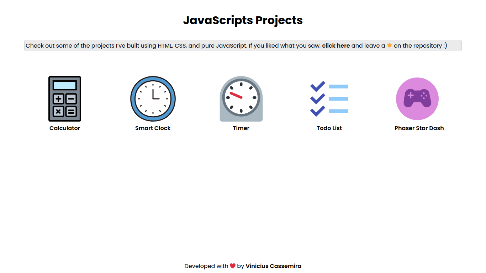

# JavaScript Projects

This repository brings together various projects I've developed using **HTML**, **CSS** and **pure JavaScript**, as part of my learning process and evolution as a front-end developer.

The main idea is to centralize the small and medium projects I've developed in a single place, making them easier to view and access.

---

## Project List

Check out the complete list of all existing projects below, view their details or access them:

| Project | Details | View |
|---------|---------|------|
| **Calculator** | [Click here](./calculator/) | [View project](https://vinicius-js.netlify.app/calculator/) |
| **Smart Clock** | [Click here](./smart-clock/) | [View project](https://vinicius-js.netlify.app/smart-clock/) |
| **Timer** | [Click here](./timer/) | [View project](https://vinicius-js.netlify.app/timer/) |
| **Todo list** | [Click here](./todo-list/) | [View project](https://vinicius-js.netlify.app/todo-list/) |
| **Star dash** | [Click here](./phaser-star-dash/) | [View project](https://vinicius-js.netlify.app/phaser-star-dash/) |

---

## Accessing the Projects

[Click here](https://js-vinicius.netlify.app) to access the website that lists and presents each of the projects available in this repository:



---

## Accessing via Docker

You can access the projects from a public Docker image by following these steps:

1. Download the image locally:
```bash
docker pull viniciuscassemira/js-projects:latest
```

2. Create a container with the image:
```bash
docker run -dp 8080:80 --name js-projs viniciuscassemira/js-projects:latest
```

3. Access in your browser:
```bash
http://localhost:8080
```

> Due to the simplicity of the projects, all were dockerized within the same image. To access a specific one, simply select it from the home page when accessing it.

---

## Contributing to the Repository

Found a bug or have an improvement idea? Your contributions are welcome! Here's how you can help:
- 🐛 **Report bugs** by opening an issue with detailed descriptions
- 💡 **Suggest new features** or improvements through issues
- 🔧 **Submit pull requests** with bug fixes or enhancements
- 📖 **Improve documentation** or add comments to existing code
- ✨ **Share ideas** for new projects to be added to the collection
